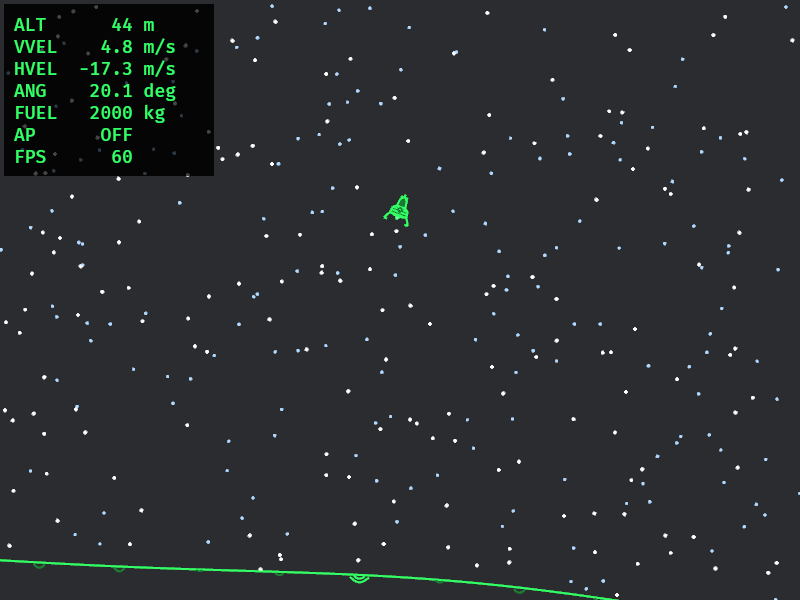
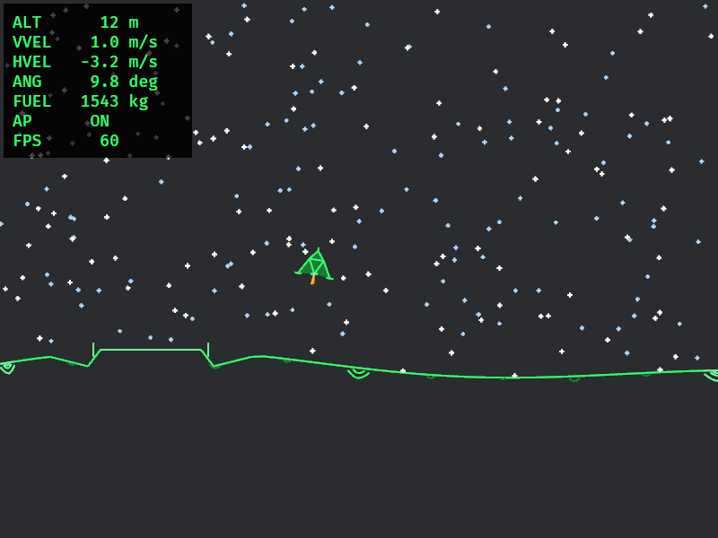
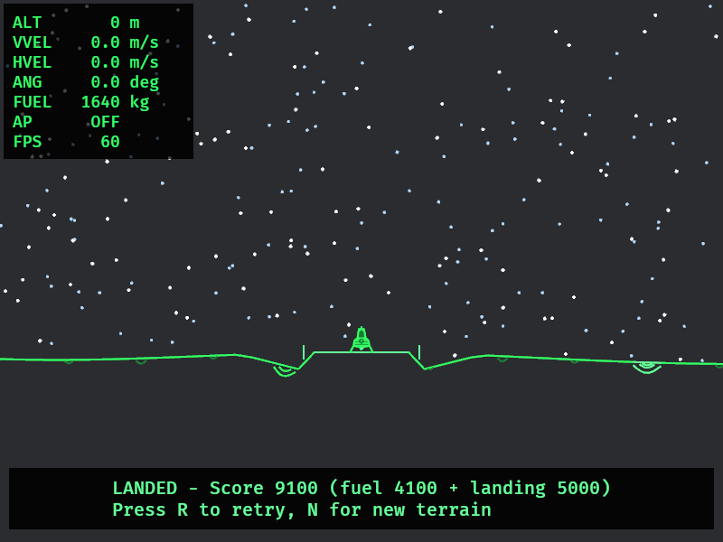

# Lunar Lander

A physics-based 2D lunar lander built in Rust with [Bevy](https://bevyengine.org/). Fly a powered descent from downrange, bleed off horizontal speed over procedural terrain, and touch down on the landing pad.



## Features

- **Rigid-body physics** — 16,000 kg lander, 45 kN main engine, attitude thrusters with realistic torque from offset thrust
- **Lunar gravity** — 1.62 m/s² surface gravity in SI units (meters, m/s, kg, newtons)
- **Procedural terrain** — rolling hills with a flat pad in the left portion of a 700 m wide map
- **Apollo-style approach** — spawn 480 m downrange at ~18 m/s horizontal velocity toward the pad
- **Autopilot** — press `P` for guided landing with attitude damping and glide-slope guidance
- **Retro HUD** — altitude above local terrain, velocities, angle, fuel, autopilot status

## Screenshots

| Downrange approach | Final approach (autopilot) | Safe touchdown |
|----------|-------------------|----------------|
|  |  |  |

## Requirements

- **Native:** Rust 1.85+ (edition 2024), GPU with Vulkan/Metal/DX12
- **Web:** A modern browser with WebGL2 (no install required)

## Run

### Native

```bash
cargo run --release
```

### Web (local)

```bash
# Install once
rustup target add wasm32-unknown-unknown
cargo install trunk --locked --version 0.20.3

# Build or serve (use --release; dev builds are slow)
NO_COLOR=false trunk build --release
NO_COLOR=false trunk serve --release
```

Open `http://127.0.0.1:8080/lunar/` (Trunk serves under `public_url`).

### Play online

After GitHub Pages is enabled for this repo, the game is published at:

**https://jasonslay.github.io/lunar/**

## Controls

| Key | Action |
|-----|--------|
| `Up` / `W` / `Space` | Main engine |
| `Left` / `A` | Tilt left (CCW) |
| `Right` / `D` | Tilt right (CW) |
| `P` | Toggle autopilot |
| `R` | Reset current terrain |
| `N` | New procedural terrain (new seed) |

## Landing criteria

A safe landing requires:

- Center of mass over the pad
- Vertical speed ≤ 3 m/s
- Horizontal speed ≤ 2 m/s
- Tilt ≤ 15°

## Development

```bash
# Debug build (native)
cargo build

# Run tests (autopilot simulation + world checks)
cargo test

# Release build (native)
cargo build --release

# Web release bundle (output in dist/)
trunk build --release
```

### Regenerating screenshots

```bash
./scripts/capture_screenshots.sh
```

This uses the built-in screenshot helper (`LUNAR_SCREENSHOT`, `LUNAR_SCENE`) to capture images into `docs/screenshots/`.

## Project layout

```
src/
  lib.rs        — Shared App builder (native + WASM)
  main.rs       — Native binary entry
  game.rs       — Game state, physics loop, landing detection
  physics.rs    — Rigid-body integration, thruster forces
  lander.rs     — Lander geometry and thruster layout
  world.rs      — Terrain generation, collision, altitude
  autopilot.rs  — Guided descent controller + simulation tests
  render.rs     — Gizmo world draw, HUD, solid lander mesh
  input.rs      — Keyboard mapping
  screenshot.rs — Native-only screenshot capture for docs
index.html      — Standalone web page shell
Trunk.toml      — WASM build and GitHub Pages config
web/style.css   — Page styling around the game canvas
```

## License

Private repository — all rights reserved.
